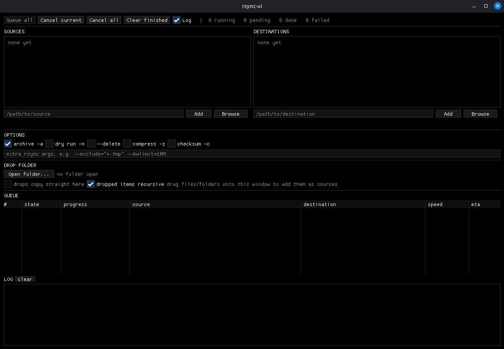

# rsync-ui-linux

Linux rsync user interface. A single Dear ImGui window that queues rsync copies
and shows live progress.

</img>

## What it does

- **Sources**: a list of files or directories, each with its own `rec` checkbox.
  Off means "copy this folder's own files, skip its subdirectories".
- **Destinations**: a list of target directories. Every source is copied into
  every destination, so N sources and M destinations produce N x M jobs.
- **Drop folder**: open a directory, tick `drops copy straight here`, and
  anything dragged onto the window is queued into that folder immediately.
  With the tick off, drops are added to the source list instead.
- **Queue**: jobs run with a progress bar, speed and ETA. Cancel one with the `x`
  on its row, or all of them from the header. A failed job goes red and the queue
  moves on. Hover a source cell to see the exact rsync command, and the error if
  it failed.
- **Pause**: freezes every running transfer and stops new ones starting. Resume
  picks up exactly where it stopped.
- **Parallel**: run up to 8 rsyncs at once. A `--delete` job always runs alone.
- **Resume**: interrupted copies continue instead of restarting, and the queue
  survives closing the app.
- **Conflicts**: every job dry-runs first, so nothing is overwritten before you
  know about it. See below.

## Install

Grab either artifact from the [latest
release](../../releases/latest). Both are x86_64 and need `rsync` on `PATH`.

```sh
# AppImage: self-contained, no install step
chmod +x rsync-ui-x86_64.AppImage
./rsync-ui-x86_64.AppImage

# or the plain executable
chmod +x rsync-ui-x86_64
./rsync-ui-x86_64
```

Release builds link libstdc++ and libgcc statically and GLFW loads X11 at
runtime, so the only hard requirements are glibc 2.35 or newer and the system's
OpenGL libraries.

## Build

```sh
cmake -S . -B build -DCMAKE_BUILD_TYPE=Release
cmake --build build -j
./build/rsync-ui
```

CMake fetches Dear ImGui and GLFW at configure time, so the first build needs
network access. Building GLFW from source needs the X11 development headers
(`sudo apt install xorg-dev` on Debian/Ubuntu). `rsync` must be on `PATH` at
runtime.

To reproduce a release build locally, including the AppImage:

```sh
cmake -S . -B build -DCMAKE_BUILD_TYPE=Release -DRSYNC_UI_PORTABLE=ON
cmake --build build -j
./packaging/make-appimage.sh build/rsync-ui dist
```

Pushing a `v*` tag runs the same steps in GitHub Actions and publishes both
artifacts to a release.

## Testing the UI

`tools/headless-run.sh` drives the app on a private Xvfb display, so a UI change
can be checked without a window appearing on your desktop and without a desktop
session at all. It takes a script of clicks, keys and screenshots:

```sh
cat > /tmp/run.txt <<'EOF'
click 217 314
wait 1
shot popup
EOF
./tools/headless-run.sh /tmp/out /tmp/run.txt
```

There is no window manager on that display, so the window sits at 0,0 with no
title bar and screenshot coordinates map straight to click coordinates.

`tools/smoke-test.sh` uses it to check the binary opens a window and paints a
frame, which is what CI runs after every build. Compiling proves nothing about
whether GL or GLFW actually came up.

## How resume works

Two separate mechanisms, both on by default.

**Within a file.** The `resumable` option adds `--partial-dir=.rsync-partial`.
A cancelled transfer leaves its half-copied file in that directory, and a re-run
picks it up instead of starting from zero. rsync excludes the directory from the
transfer and from `--delete`, and removes it once the file completes. For very
large files over a slow link, `--append-verify` in the extra-args box is the
stricter version: it checksums the bytes already there and appends the rest.

**Across restarts.** Sources, destinations, options and every unfinished job are
written to `$XDG_STATE_HOME/rsync-ui/session.tsv` (usually
`~/.local/state/rsync-ui/session.tsv`). On the next launch they come back and the
queue starts **paused**, so nothing runs until you press Resume. Done, failed and
cancelled rows are not saved.

## Conflicts

Every job runs in two phases, shown in the queue's state column: **dry**, then
**live**. The dry phase is `rsync -n -i`, which changes nothing and lists what
would happen. A conflict is anything already in the destination that the live run
would replace or, with `--delete`, remove. Brand new files are never conflicts.

The `on conflict` dropdown decides what happens when the dry phase finds some:

- **Pause on any conflict**: nothing is copied. The job waits at **conflicts**.
- **Work around, then resolve**: everything that is not in conflict is copied
  now, then the job waits at **conflicts** with the rest.
- **Skip conflicts**: everything that is not in conflict is copied and the job
  finishes. Existing files are never touched.

A waiting job shows a **Resolve conflicts** button. The popup has two tabs:
quick actions that decide every file at once (overwrite everything, keep the
destination, only where the source is newer), and a file list where each row is
ticked to apply or unticked to leave alone, showing both sizes and both
timestamps. Applying re-runs the job with your answer.

One caveat worth knowing: rsync compares size and modification time, not
contents, unless `checksum -c` is ticked. Two files with the same size and
timestamp are treated as identical and never appear as a conflict.

## Notes

- rsync is launched with `fork` + `execvp`, never through a shell, so paths with
  spaces, quotes or `$` need no escaping.
- Skipping a file writes it to an `--exclude-from` list with `*`, `?`, `[` and
  `\` backslash-escaped. rsync filter rules are patterns, so an unescaped
  `weird[1].txt` would skip `weird1.txt` instead. Excluding a path also protects
  it from `--delete`, which is what makes keeping a destination file work.
- Each rsync gets its own process group, so pause and cancel signal the whole
  rsync tree rather than just the top process.
- Jobs run with `--info=progress2 --no-inc-recursive`. The second flag makes the
  percentage monotonic; without it rsync keeps discovering files mid-transfer and
  the bar slides backwards.
- Source paths are passed without a trailing slash, so copying `/a/photos` into
  `/b` lands at `/b/photos` rather than dumping the contents into `/b`.
- `--delete` removes files from the destination and is behind a confirmation.
  Try a dry run first.
